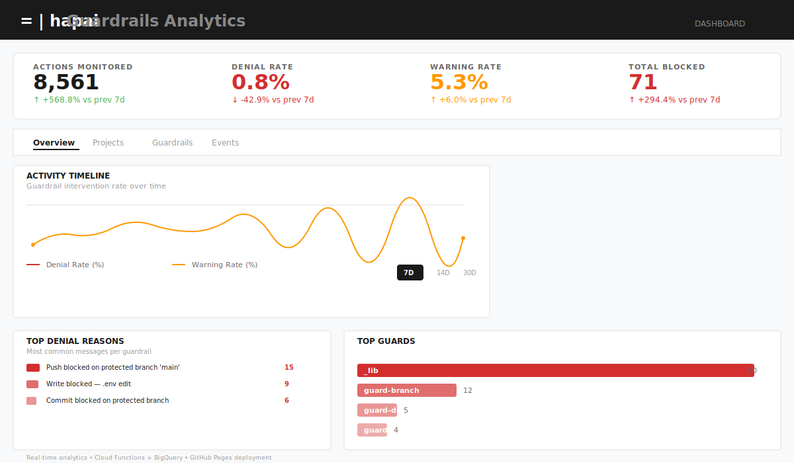

# hapai

```
─── │  ╦ ╦╔═╗╔═╗╔═╗╦
    │  ╠═╣╠═╣╠═╝╠═╣║
    │  ╩ ╩╩ ╩╩  ╩ ╩╩
        guardrails for AI coding assistants
```

[](https://github.com/renatobardi/hapai)
[](https://github.com/renatobardi/hapai/actions/workflows/ci.yml)
[](tests/run-tests.sh)
[](LICENSE)
[](https://github.com/renatobardi/hapai/releases)

> Deterministic guardrails for AI coding assistants. Hooks that enforce rules **before execution** — not probabilistic prompts that get ignored.

**hapai** v1.7+ combines shell-based enforcement hooks with a cloud-native analytics dashboard. It intercepts Claude Code, Cursor, and Copilot tool calls in real-time and blocks violations immediately. When combined with Cloud Storage + BigQuery + GitHub Pages, it provides real-time visibility into guard enforcement across your team.

## What's New in v1.7.0

- **Dashboard reform** — Tabbed layout (Overview, Projects, Guardrails, Events) with KPI bar, project health scores, denial reasons, and guardrail glossary
- **Audit dedup pipeline** — 4-layer dedup: unique `event_id` per event, flow-dispatcher guard, incremental sync with cursor, BigQuery MERGE on `event_id`
- **Hook enrichment** — 22-field `context` RECORD in BigQuery: git op, branch, file category, risk tier, enforcement method, and more — enables deep analytics
- **7 new BigQuery queries** — `stats_comparison`, `project_health`, `denial_reasons`, `context_breakdown`, `hook_detail`, `tool_detail` + dedup CTE on all queries
- **API hardening** — 30s timeout, per-status error messages, SonarQube-compliant exception handling
- **Hook name resolution** — `audit_log()` resolves hook via `BASH_SOURCE[]` walk (fixes `_lib` pollution in audit logs)
- **Gen2 Cloud Function** — `load_audit_from_gcs` updated for Gen2 CloudEvent format; separate `hapai-bq-query` HTTP function for dashboard

## The Problem

AI coding tools frequently ignore markdown instructions and safety guidelines. They commit to protected branches, edit secrets files, run destructive commands, and add AI attribution despite explicit rules.

**Why this happens:** LLMs see markdown as suggestions, not requirements.

**The solution:** Deterministic enforcement via hooks running *before* the action, not after.

## Quick Start

```bash
# Install (no sudo required)
curl -fsSL https://raw.githubusercontent.com/renatobardi/hapai/main/install.sh | bash

# Reload PATH
source ~/.profile

# Install globally (all projects)
hapai install --global

# Or per-project
cd your-project && hapai install --project

# Verify
hapai validate
```

## Guardrails (Block Before Execution)

| Guardrail | What it prevents | Config key |
|-----------|-----------------|-----------|
| **Branch Protection** | Commits/pushes/`gh api` deletions on protected branches (main, master, etc.) | `branch_protection.protected` |
| **Branch Taxonomy** | Enforces naming conventions (feat/, fix/, chore/, etc.) | `branch_taxonomy.allowed_prefixes` |
| **Branch Rules** | Validates description + origin branch | `branch_rules.enabled` |
| **Commit Hygiene** | Co-Authored-By, AI mentions, "Generated with Claude" | `commit_hygiene.blocked_patterns` |
| **File Protection** | Writes to .env, lockfiles, CI workflow files | `file_protection.protected` |
| **Destructive Commands** | `rm -rf`, `git push --force`, `git reset --hard`, `DROP TABLE` | `command_safety.blocked` |
| **Blast Radius** | Large commits touching too many files or packages | `blast_radius.max_files` |
| **Uncommitted Changes** | AI overwriting your uncommitted work | `uncommitted_changes.enabled` |
| **PR Review** | Background code review on all PRs (with optional auto-fix) | `pr_review.enabled` |
| **Git Workflow** | Trunk-based or GitFlow enforcement | `git_workflow.model` |

All guardrails support `fail_open`:
- **`fail_open: false`** — Block execution, show error
- **`fail_open: true`** — Warn but allow (soft constraints)

## Automations

Automations run in the background after tool execution, enabling proactive code fixes and improvements.

### Auto-Fix for PR Review Issues

When code review finds issues, **automatically attempt to fix them before blocking the push**.

**How it works:**
1. Code review detects issues (critical, high, medium, or low severity)
2. If `auto_fix.enabled: true`, launch background fix agent
3. Fix agent invokes a model to apply corrections to the code
4. Re-run review synchronously to validate fixes
5. If all issues resolved → allow push (`fix_clean` state)
6. If issues remain after max attempts → block push with list of failures (`fix_failed` state)

**Configuration:**
```yaml
guardrails:
  pr_review:
    auto_fix:
      enabled: false              # opt-in (requires pr_review.enabled=true)
      model: "claude-sonnet-4-6"  # model for applying fixes
      max_fix_attempts: 2         # rounds of fix → re-review → fix
      severities:                 # which issues to auto-fix
        - critical
        - high
        - medium
        - low
```

**Disabled by default** — double opt-in ensures this is explicit and project-aware.

## Analytics Dashboard

Deploy a real-time analytics dashboard to GitHub Pages to monitor guardrail events across your team.

### Live Demo

**[🚀 View Live Demo](https://renatobardi.github.io/hapai)** — Real-time dashboard showing guardrail enforcement across teams.



### Features

- **KPI Bar** — Denials, warnings, allows, deny rate, allow rate — with period comparison (current vs previous), trend arrows, and sparklines
- **Timeline** — Daily denial/warning rates (7/14/30-day rolling window, server-side period switching)
- **Project Health** — Per-project deny rate, top guard, event counts, and health score
- **Denial Reasons** — Top denial reasons aggregated by frequency with guard drill-down
- **Guardrail Glossary** — All guards with descriptions, deny/warn counts, and inline drill-down
- **Drill-down (L2)** — Click any guard or tool to see mini-timeline, breakdown bars, and recent events (server-side via `hook_detail`/`tool_detail` queries)
- **Event Detail (L3)** — Full-screen drawer with all event fields, ← Previous / Next → navigation
- **Events Feed** — Server-side paginated event table with load-more support
- **Context Analytics** — File categories, risk tiers, branches, patterns — powered by the 22-field `context` RECORD in BigQuery

### Architecture

```
~/.hapai/audit.jsonl (with event_id + context)
    ↓ hapai sync (incremental, cursor-based)
gs://hapai-audit-{name}/YYYY-MM/DD-offset-N.jsonl
    ↓ load_audit_from_gcs (Gen2 Cloud Function, Storage trigger)
hapai_dataset.events (BigQuery, MERGE dedup on event_id)
    ↓ hapai-bq-query (HTTP Cloud Function, Firebase auth)
Dashboard (Svelte 5, GitHub Pages)
```

### Dashboard Views

**Overview Tab** — Real-time guardrail enforcement snapshot
```
┌─────────────────────────────────────────────────────┐
│  📊 KPI Bar: Denials | Warnings | Allow Rate | Deny │
├─────────────────────────────────────────────────────┤
│  📈 Timeline: Daily enforcement trends (7/14/30d)   │
│  🎯 Project Health: Per-project health scores       │
│  📋 Denial Reasons: Top reasons ranked by frequency │
└─────────────────────────────────────────────────────┘
```

**Projects Tab** — Per-project enforcement summary
```
Project Name          Deny Rate    Top Guard          Events
──────────────────────────────────────────────────────────
my-app               12%           branch-protection  234
api-service          8%            file-protection    89
dashboard            5%            commit-hygiene     42
```

**Guardrails Tab** — Guard documentation & stats
```
Guard               Blocks    Warns    Last Event      Drill-Down
────────────────────────────────────────────────────────────────
branch-protection   1,245     342      2 min ago       [Details]
file-protection     523       91       15 min ago      [Details]
commit-hygiene      187       445      1 hour ago      [Details]
```

**Events Tab** — Full audit log with filtering
```
Timestamp     Hook                Tool    Project    Result    Reason
──────────────────────────────────────────────────────────────────────
14:32:15      guard-branch        Bash    my-app     DENY      Protected branch
14:31:02      guard-files         Write   api-service DENY     .env edit blocked
14:29:45      guard-blast-radius  Bash    dashboard   WARN     7 files touched
[Load More...]
```

### Setup

1. Create Firebase project with GitHub OAuth provider
2. Deploy two Cloud Functions: `load_audit_from_gcs` (Storage trigger) + `hapai-bq-query` (HTTP trigger)
3. Set GitHub Actions secrets (`VITE_FIREBASE_API_KEY`, `VITE_FIREBASE_APP_ID`, `VITE_BQ_PROXY_URL`)
4. Merge to main → GitHub Actions builds and deploys to GitHub Pages
5. Dashboard live at: `https://{owner}.github.io/{repo}/`

**Live Demo:** https://renatobardi.github.io/hapai (requires GitHub OAuth login)

See [`infra/gcp/SETUP.md`](infra/gcp/SETUP.md) for complete setup guide.

## Cloud Logging (Optional)

Sync audit logs to GCP for enterprise analytics and compliance.

**Architecture:**
```
~/.hapai/audit.jsonl (event_id + context per entry)
    ↓ hapai sync (incremental — cursor-based, delta only)
gs://hapai-audit-{name}/YYYY-MM/DD-offset-N.jsonl
    ↓ load_audit_from_gcs (Gen2 Cloud Function, Storage trigger)
hapai_dataset.events (BigQuery — MERGE dedup on event_id)
    ↓ hapai-bq-query (HTTP Cloud Function, Firebase auth)
Analytics Dashboard (Svelte 5, GitHub Pages)
```

**Auto-sync — get data to GCS automatically:**

| Method | When | How |
|--------|------|-----|
| **Claude Code** | Session end | `gcp.auto_sync.enabled: true` in `hapai.yaml` |
| **Cursor · Windsurf · Devin · Trae · Copilot** | After each commit | `hapai install --git-hooks` |
| **CI (safety net)** | Daily at 2h UTC | `hapai-sync.yml` — loads from GCS to BigQuery |

**Local sync:**
```bash
# Authenticate once
gcloud auth application-default login

# Sync audit log to GCS + BigQuery
hapai sync
```

**What you get:**
- Immutable audit trail in BigQuery
- Real-time dashboard with 30-day rolling analytics
- No service account keys locally (ADC via `gcloud auth application-default login`)
- No service account keys in CI (OIDC + Workload Identity)
- Automatic daily ingestion via `hapai-sync.yml` for any GCS data not yet in BigQuery

See [`infra/gcp/SETUP.md`](infra/gcp/SETUP.md) for setup instructions.

## Automations (Run After Execution)

| Automation | What it does | Config key |
|-----------|-------------|-----------|
| **Auto-Checkpoint** | Granular git snapshots per file edited | `automation.auto_checkpoint` |
| **Auto-Format** | Runs prettier/ruff/black after writes | `automation.auto_format` |
| **Auto-Lint** | Runs ESLint/ruff/pylint, reports issues | `automation.auto_lint` |
| **Squash on Stop** | Consolidates checkpoints into clean commits | `automation.auto_checkpoint.squash_on_stop` |

## CLI Commands

### Installation
```bash
hapai install --global        # Global (~/.hapai)
hapai install --project       # Per-project (./hapai/)
hapai install --git-hooks     # Post-commit auto-sync (Cursor/Windsurf/Devin/Trae/Copilot)
hapai uninstall [--global]    # Remove hooks
hapai uninstall --git-hooks   # Remove post-commit hook
hapai validate                # Verify installation
```

### Monitoring
```bash
hapai status                  # Hook registration and active guardrails
hapai audit [N]               # Show last N audit entries (default: 20)
```

### Emergency
```bash
hapai kill                    # Disable all hooks immediately
hapai revive                  # Re-enable hooks
```

### Export
```bash
hapai export --target cursor     # Generate Cursor rules
hapai export --target copilot    # Generate Copilot rules
hapai export --target claude     # Generate CLAUDE.md rules
```

## Configuration

YAML-based with three-tier fallback:
1. **Project** `./hapai.yaml` (overrides all)
2. **Global** `~/.hapai/hapai.yaml`
3. **Defaults** `hapai.defaults.yaml`

### Quick Start
```bash
cp hapai.defaults.yaml hapai.yaml
# Edit hapai.yaml for your project
```

### Example: Strict Settings
```yaml
version: "1.0"
risk_tier: high

guardrails:
  branch_protection:
    enabled: true
    protected: [main, develop]
    fail_open: false

  branch_taxonomy:
    enabled: true
    allowed_prefixes: [feat, fix, chore, docs, refactor]
    require_description: true
    fail_open: false

  blast_radius:
    enabled: true
    max_files: 5
    max_packages: 1
    fail_open: false  # Block large changes

  pr_review:
    enabled: true
    model: "claude-haiku-4-5-20251001"
    fail_open: false  # Require review to pass

automation:
  auto_format:
    enabled: true
    python: "ruff format {file}"
    javascript: "prettier --write {file}"
```

## Architecture

**Technology Stack:**
- **Hooks**: Pure Bash (~1,550 LOC)
- **CLI**: Pure Bash (~645 LOC)
- **Dashboard**: Svelte 5 + Vite
- **Backend**: Python Cloud Functions
- **Analytics**: BigQuery
- **Auth**: Firebase Auth + GitHub OAuth
- **Deployment**: GitHub Pages + OIDC

**Design Principles:**
- **Graceful Failure** — Hooks never crash Claude Code
- **Timeouts** — PreToolUse (7s), PostToolUse (5s), Stop (10s)
- **Modular** — One concern per file, 50-100 LOC
- **Immutable Audit** — Append-only JSONL audit log

**Directory Structure:**
```
~/.hapai/
├── hooks/
│   ├── _lib.sh (config, JSON I/O, audit)
│   ├── pre-tool-use/ (11 guardrails)
│   ├── post-tool-use/ (automations)
│   └── stop/ (session cleanup)
├── audit.jsonl (immutable audit log)
└── state/ (cross-session counters)

project-root/
├── hapai.yaml (project config)
├── infra/gcp/
│   ├── dashboard/ (Svelte 5 frontend)
│   ├── functions/ (Cloud Function)
│   └── SETUP.md (deployment guide)
├── .github/workflows/
│   ├── hapai-sync.yml (OIDC Cloud Storage sync)
│   └── deploy-dashboard.yml (GitHub Pages)
```

## Testing

```bash
bash tests/run-tests.sh
```

Pure bash assertions (no test framework). ~200 assertions covering:
- Unit tests for 11 guardrail modules
- Integration tests (config, JSON, audit)
- End-to-end tests (hooks, CLI)

## Requirements

- **bash** (macOS default bash 3.2+ works fine)
- **jq** (JSON parser)
- **git** (for guard scripts)
- **Node.js 24+** (for GitHub Actions workflows only)

For cloud logging (optional):
- **gcloud CLI** (Cloud Storage, Cloud Functions, BigQuery)
- **firebase-admin** (Python, Cloud Function runtime)

## Troubleshooting

**Q: Hooks aren't blocking. Why?**
```bash
hapai status              # Check registration
hapai audit               # See what hooks decided
# Edit hapai.yaml: ensure fail_open: false
```

**Q: How do I see hook execution?**
```bash
hapai audit 50 | jq      # Recent entries
tail -f ~/.hapai/audit.jsonl | jq  # Live stream
```

**Q: Can I disable a guardrail?**
```yaml
# In hapai.yaml
guardrails:
  branch_protection:
    enabled: false  # Disable specific guard
```

**Q: Custom guardrails?**

Create `~/.hapai/hooks/pre-tool-use/my-guard.sh`:
```bash
#!/bin/bash
source "$HAPAI_LIB"
# Your logic here
exit 0  # allow
# or exit 2  # deny
```

## License

MIT — See LICENSE file.

## Contributing

Contributions welcome! Please see [CONTRIBUTING.md](CONTRIBUTING.md) for:
- How to set up your development environment
- How to write and test new guardrails
- Commit conventions and PR process
- Philosophy and design principles

Quick checklist:
1. Add tests for new features (`bash tests/run-tests.sh`)
2. Follow bash conventions (`set -euo pipefail`, shellcheck)
3. Keep modules modular (50-100 LOC)
4. Document config keys in `hapai.defaults.yaml`
5. Update CHANGELOG.md

## Community

- **Report a bug:** [GitHub Issues](https://github.com/renatobardi/hapai/issues/new?template=bug_report.md)
- **Request a feature:** [GitHub Issues](https://github.com/renatobardi/hapai/issues/new?template=feature_request.md)
- **Setup Guide:** [infra/gcp/SETUP.md](infra/gcp/SETUP.md)
- **Developer Guide:** [CLAUDE.md](CLAUDE.md)
- **Usage Examples:** [USAGE.md](USAGE.md) (Portuguese)
