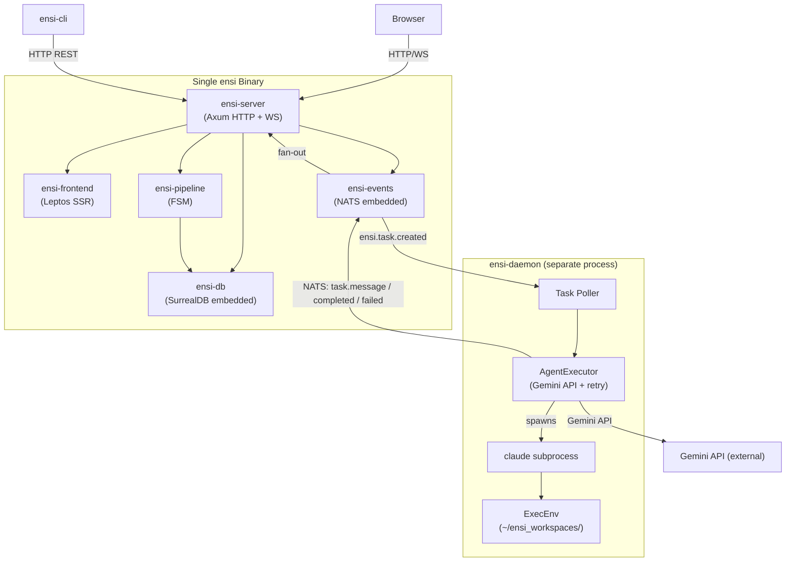
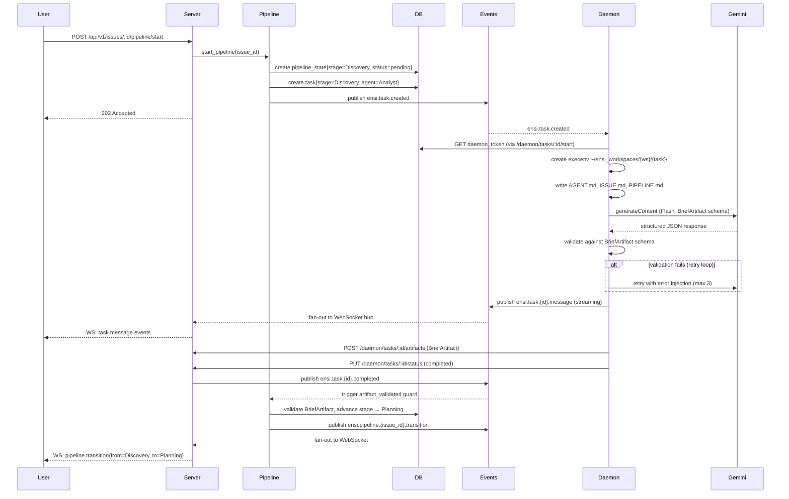
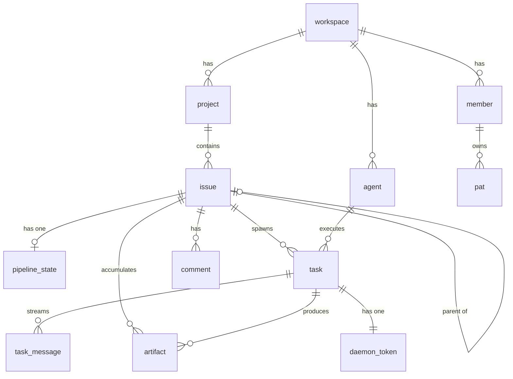

# Ensi v1 — Architecture Document

**Version:** 1.0  
**Date:** 2026-04-17  
**Author:** Architect (SysArch)  
**Status:** Final — feeds SM and Dev agents

---

## 1. Tech Stack Selection

### Frontend — Leptos 0.7 SSR + WASM

**Choice:** Leptos with Axum-hosted SSR, WASM hydration, TailwindCSS.

**Why over Next.js / SvelteKit:** SP-02 validated that Leptos + Axum runs as a single Rust binary. This eliminates a separate Node.js runtime and lets us ship one executable that serves both the API and the SSR frontend. For a Rust-first team, removing the language context switch is a significant DX win.

**Trade-offs accepted:**
- DnD not available — click-to-move on the board (see ADR-005)
- LOC ~30% higher than Next.js equivalent
- 3–4 day learning curve for Rust devs new to reactive signals

**Version:** Leptos 0.7, TailwindCSS 3.x via trunk, leptos_router for SPA-style routing.

---

### Backend — Rust + Axum 0.8

**Choice:** Axum 0.8 with Tokio async runtime.

**Why over Actix-web / Express:** Axum integrates naturally with Leptos SSR via `axum::Router`. Tower middleware ecosystem covers auth, CORS, and request tracing. Type-safe extractors eliminate a class of runtime panics. Axum is the natural home for a Rust backend — no strong reason to deviate.

**Trade-offs accepted:** Slightly more verbose route handlers than Actix; Axum 0.8 API is stable and well-documented.

---

### Database — SurrealDB 3.0 Embedded

**Choice:** SurrealDB 3.0 in embedded mode (no separate process). Data at `~/ensi_data/`.

**Why over PostgreSQL:** Single-binary deployment is a hard NFR for v1. Embedded SurrealDB removes the ops burden of a separate DB process. SCHEMAFULL mode gives schema enforcement. Native `record<>` links express workspace/project/issue hierarchies cleanly. The `object` field type stores artifact JSON blobs without a separate serialization step.

**Trade-offs accepted:** Smaller ecosystem than Postgres; no horizontal scale in embedded mode (acceptable — v1 is single-node). See ADR-004.

**Migration strategy:** SurrealDB DDL statements in `ensi-db/migrations/*.surql`, applied at startup. Each file is named `V{n}__{description}.surql`. Applied idempotently via a `_migration` table.

---

### Messaging — NATS JetStream Embedded

**Choice:** NATS server in embedded mode (same process as `ensi-server`).

**Why over Redis Pub/Sub / Kafka:** NATS is embeddable in Rust via `async-nats`. JetStream provides durable delivery for task events without a separate broker process. Subject-based addressing (`ensi.task.*`) gives us clean fan-out from daemon to server.

**Trade-offs accepted:** NATS JetStream durability requires persistence config — streams must be declared at startup.

---

### LLM — Gemini API (Flash + Pro)

**Choice:** `gemini-2.0-flash` for Discovery and Development stages; `gemini-2.5-pro` for Planning and Architecture.

**Why:** SP-01 validated structured output with schema preprocessing. Flash covers latency-sensitive stages; Pro covers the two stages where reasoning quality matters most (PRD and Architecture). See ADR-002.

**Constraints from SP-01:** Strip `additionalProperties`, `$ref`, `oneOf`, `anyOf` from schemas before sending to Gemini. Max 3 retries with error injection on validation failure.

---

### Auth — JWT HS256 + PAT + Daemon Token

**Choice:** Three-token model:
- `JWT HS256` — short-lived user sessions (24h expiry)
- `PAT ens_*` — long-lived API tokens for members
- `DaemonToken edt_*` — per-task short-lived tokens for daemon-to-server comms

**Why not OAuth2/OIDC:** Out of scope for v1. Auth provider integration deferred. JWT HS256 with a server-managed secret is the simplest correct approach for a single-tenant MVP.

---

### Deploy — Single Binary

**Choice:** `cargo build --release` produces a single `ensi` binary. Embeds: Axum HTTP server, Leptos SSR, SurrealDB, NATS, static assets.

**Why:** NFR for v1 is local deployment simplicity. No container orchestration, no managed DBs, no reverse proxy required.

---

### CI/CD

**Choice:** GitHub Actions, `cargo test` + `cargo clippy` on PR. Release artifact is a single binary uploaded to GitHub Releases.

---

## 2. System Architecture

### High-Level Component Diagram



### Service Boundaries

| Component | Process | Communicates via |
|---|---|---|
| `ensi-server` | main | HTTP/WS inbound, NATS outbound |
| `ensi-daemon` | separate | NATS inbound/outbound, HTTP daemon endpoints |
| `ensi-frontend` | compiled into ensi-server | Axum SSR handler |
| `ensi-cli` | CLI process | REST API |

### Data Flow — Pipeline Execution (Critical Path)



### Data Flow — WebSocket Task Feed (Real-Time UI)

The `ensi-server` maintains an in-memory WebSocket hub (topic: workspace_id). On NATS message receipt, the hub broadcasts to all connected WS clients subscribed to that workspace. No persistence in the hub — clients reconnect and re-fetch from `GET /tasks/:id/messages`.

---

## 3. Data Model

### Core Entity Relationships



### Key Schema Decisions

- **`issue.number`** — sequential integer within project (e.g., ENS-42). Auto-incremented via SurrealDB transaction on `project.issue_counter`.
- **`pipeline_state`** — one-to-one with issue. Single source of truth for where in the pipeline an issue is.
- **`artifact.data`** — stored as `object` (SurrealDB native JSON). No separate blob storage for v1.
- **`task_message.sequence`** — monotonic int per task. Enables incremental fetch (`?since_seq=N`) for the daemon and UI.
- **`daemon_token.expires_at`** — set to task creation time + 12h. Revoked automatically on task completion.

### SurrealQL Schema (abbreviated)

```surql
-- Core tables (full DDL in ensi-db/migrations/V001__initial_schema.surql)

DEFINE TABLE workspace SCHEMAFULL;
DEFINE FIELD name       ON workspace TYPE string;
DEFINE FIELD slug       ON workspace TYPE string;
DEFINE FIELD created_at ON workspace TYPE datetime DEFAULT time::now();
DEFINE INDEX idx_workspace_slug ON workspace COLUMNS slug UNIQUE;

DEFINE TABLE issue SCHEMAFULL;
DEFINE FIELD project_id   ON issue TYPE record<project>;
DEFINE FIELD workspace_id ON issue TYPE record<workspace>;
DEFINE FIELD number       ON issue TYPE int;
DEFINE FIELD title        ON issue TYPE string;
DEFINE FIELD description  ON issue TYPE option<string>;
DEFINE FIELD status       ON issue TYPE string ASSERT $value IN ["todo","in_progress","in_review","done","blocked"];
DEFINE FIELD priority     ON issue TYPE string ASSERT $value IN ["urgent","high","medium","low"];
DEFINE FIELD parent_id    ON issue TYPE option<record<issue>>;
DEFINE FIELD assignee_id  ON issue TYPE option<string>;
DEFINE FIELD assignee_type ON issue TYPE option<string>;
DEFINE FIELD created_at   ON issue TYPE datetime DEFAULT time::now();
DEFINE FIELD updated_at   ON issue TYPE datetime DEFAULT time::now();
DEFINE INDEX idx_issue_project ON issue COLUMNS project_id;
DEFINE INDEX idx_issue_number  ON issue COLUMNS project_id, number UNIQUE;

DEFINE TABLE pipeline_state SCHEMAFULL;
DEFINE FIELD issue_id          ON pipeline_state TYPE record<issue>;
DEFINE FIELD stage             ON pipeline_state TYPE string;
DEFINE FIELD stage_status      ON pipeline_state TYPE string ASSERT $value IN ["pending","running","done","failed"];
DEFINE FIELD blocked_from_stage ON pipeline_state TYPE option<string>;
DEFINE FIELD current_task_id   ON pipeline_state TYPE option<record<task>>;
DEFINE FIELD retry_count       ON pipeline_state TYPE int DEFAULT 0;
DEFINE FIELD created_at        ON pipeline_state TYPE datetime DEFAULT time::now();
DEFINE FIELD updated_at        ON pipeline_state TYPE datetime DEFAULT time::now();
DEFINE INDEX idx_pipeline_issue ON pipeline_state COLUMNS issue_id UNIQUE;

DEFINE TABLE artifact SCHEMAFULL;
DEFINE FIELD issue_id         ON artifact TYPE record<issue>;
DEFINE FIELD artifact_type    ON artifact TYPE string;
DEFINE FIELD pipeline_stage   ON artifact TYPE string;
DEFINE FIELD data             ON artifact TYPE object;
DEFINE FIELD schema_version   ON artifact TYPE string DEFAULT "1.0";
DEFINE FIELD created_by_task  ON artifact TYPE record<task>;
DEFINE FIELD created_at       ON artifact TYPE datetime DEFAULT time::now();
DEFINE INDEX idx_artifact_issue ON artifact COLUMNS issue_id;
DEFINE INDEX idx_artifact_type  ON artifact COLUMNS issue_id, artifact_type;
```

---

## 4. API Design

### REST API

Base path: `/api/v1`  
Content-Type: `application/json`  
Auth: `Authorization: Bearer <jwt|ens_*>` (all endpoints except `/auth/login`)

#### Auth
| Method | Path | Notes |
|--------|------|-------|
| POST | `/auth/login` | `{email, password}` → `{token, expires_at}` |
| GET  | `/auth/me` | Returns current member identity |
| POST | `/auth/pat` | `{name, expires_at?}` → `{id, token: "ens_...", created_at}` — token shown once |
| GET  | `/auth/pat` | List PATs (token not returned) |
| DELETE | `/auth/pat/:pat_id` | Revoke PAT |

#### Issues
| Method | Path | Notes |
|--------|------|-------|
| GET  | `/projects/:pid/issues` | Query: `status`, `priority`, `assignee`, `limit`, `offset` |
| POST | `/projects/:pid/issues` | Create issue |
| GET  | `/issues/:id` | Full issue with pipeline_state embedded |
| PATCH | `/issues/:id` | Partial update |
| DELETE | `/issues/:id` | Hard delete |

#### Pipeline
| Method | Path | Notes |
|--------|------|-------|
| GET  | `/issues/:id/pipeline` | Returns `pipeline_state` + current task summary |
| POST | `/issues/:id/pipeline/start` | Starts Discovery stage — idempotent if already started |
| POST | `/issues/:id/pipeline/unblock` | Human override: resets `retry_count`, resumes blocked stage |

#### Tasks & Artifacts
| Method | Path | Notes |
|--------|------|-------|
| GET  | `/issues/:id/tasks` | List tasks ordered by created_at desc |
| GET  | `/tasks/:id` | Task detail |
| GET  | `/tasks/:id/messages` | Params: `limit=100&since_seq=0` |
| GET  | `/issues/:id/artifacts` | List artifacts |
| GET  | `/artifacts/:id` | Full artifact including `data` blob |

### Daemon Endpoints (edt_* token required)

```
POST /daemon/tasks/:task_id/messages     → append TaskMessage
PUT  /daemon/tasks/:task_id/status       → { status: "completed"|"failed", error?: string }
POST /daemon/tasks/:task_id/artifacts    → { artifact_type, data: object }
```

### WebSocket

`GET /api/v1/ws` — upgrade to WebSocket. Client sends `{"subscribe": "workspace:<ws_id>"}` after connect. Server pushes event objects:

```json
{"type": "task.message",        "task_id": "...", "seq": 42, "role": "assistant", "content": "..."}
{"type": "task.completed",      "task_id": "...", "artifact_type": "BriefArtifact"}
{"type": "pipeline.transition", "issue_id": "...", "from": "Discovery", "to": "Planning"}
```

### Error Response Format

```json
{
  "error": {
    "code": "ARTIFACT_VALIDATION_FAILED",
    "message": "BriefArtifact missing required field: product_name",
    "details": { "field": "product_name", "schema_path": "#/required" }
  }
}
```

HTTP status codes: 400 (validation), 401 (unauthenticated), 403 (forbidden), 404 (not found), 409 (conflict), 429 (rate limit — future), 500 (internal).

---

## 5. Cross-Cutting Concerns

### Authentication & Authorization

Token resolution order (Axum middleware):
1. Extract `Authorization: Bearer <token>`
2. If token starts with `ens_` → lookup `pat` table by bcrypt comparison, load member
3. If token starts with `edt_` → lookup `daemon_token`, enforce daemon-only routes
4. Otherwise → JWT decode and verify HS256 signature, extract `sub` + `ws` claims
5. Attach `AuthContext { member_id, workspace_id, role }` to request extensions

Authorization checks happen at the handler level via `AuthContext`. Workspace isolation is enforced: every DB query filters by `workspace_id` from the token claims.

### Observability

v1 is deliberately minimal — observability is out of scope per PRD.

Applied nonetheless:
- `tracing` crate with `tracing_subscriber` JSON formatter (structured logs to stdout)
- Log levels: ERROR for unexpected failures, INFO for pipeline transitions, DEBUG for HTTP requests
- No distributed tracing, no metrics aggregation in v1

### Error Handling

- Axum handlers return `Result<Json<T>, AppError>`
- `AppError` is an enum that implements `IntoResponse` → produces the standard error JSON format
- Unrecoverable startup errors (DB init, NATS bind, missing HMAC secret) → `panic!` with message — process exits, restartable
- Task failures in daemon → publish `ensi.task.{id}.failed`, let pipeline FSM handle retry or block

### Security

- **Input validation:** All request bodies validated via `serde` + custom validators. Issue title max 512 chars. Description max 64KB.
- **CORS:** Restrictive — only same-origin in v1 (Leptos SSR is same-origin by design)
- **Secrets management:** HMAC secret and Gemini API key from env vars (`ENSI_JWT_SECRET`, `GEMINI_API_KEY`). Never logged.
- **SQL injection:** Not applicable — SurrealDB Rust SDK uses parameterized queries
- **SSRF:** Gemini API calls go to `generativelanguage.googleapis.com` only — no user-controlled URLs in v1
- **Dependency scanning:** `cargo audit` in CI on every PR

### Testing Strategy

| Layer | Tool | Target |
|-------|------|--------|
| Unit | `cargo test` | Domain logic in `ensi-core`, FSM transitions in `ensi-pipeline`, schema preprocessing in `ensi-daemon` |
| Integration | `cargo test` + in-memory SurrealDB | Repository impls in `ensi-db`, pipeline end-to-end |
| API | `axum::test` + test client | REST endpoint contracts, auth enforcement |
| E2E | Manual + Playwright (v1.1) | Full pipeline run in dev environment |

Coverage target: 80% for `ensi-core` and `ensi-pipeline`. Lower for `ensi-frontend` (UI testing deferred).

---

## 6. Project Structure

```
ensi/
├── Cargo.toml                  # workspace manifest, members list
├── Cargo.lock
├── .env.example                # ENSI_JWT_SECRET, GEMINI_API_KEY, ENSI_DATA_PATH
├── crates/
│   ├── ensi-core/              # domain entities + port traits — NO external deps
│   │   └── src/
│   │       ├── lib.rs
│   │       ├── domain/         # Issue, Task, Artifact, PipelineState, Member, Agent, etc.
│   │       ├── ports/          # IssueRepository, AgentExecutor, EventPublisher, etc.
│   │       └── errors.rs       # CoreError enum
│   ├── ensi-db/                # SurrealDB adapter
│   │   └── src/
│   │       ├── lib.rs
│   │       ├── client.rs       # SurrealDB init + health check
│   │       ├── repo/           # one file per Repository impl
│   │       └── migrations/     # V001__initial_schema.surql, V002__*.surql, ...
│   ├── ensi-events/            # NATS adapter
│   │   └── src/
│   │       ├── lib.rs
│   │       ├── client.rs       # NATS init, stream declarations
│   │       ├── publisher.rs    # EventPublisher impl
│   │       └── subjects.rs     # subject constants: TASK_CREATED, TASK_MESSAGE, etc.
│   ├── ensi-pipeline/          # Pipeline FSM
│   │   └── src/
│   │       ├── lib.rs
│   │       ├── fsm.rs          # PipelineState transitions + guards
│   │       ├── stages.rs       # per-stage handler: which agent, which artifact schema
│   │       └── validator.rs    # artifact JSON schema validation
│   ├── ensi-server/            # Axum HTTP + WS server binary
│   │   └── src/
│   │       ├── main.rs
│   │       ├── app.rs          # Router assembly, state injection
│   │       ├── routes/         # one file per resource group (auth, issues, pipeline, tasks, ...)
│   │       ├── middleware/      # auth extractor, error layer
│   │       └── ws/             # WebSocket hub, upgrade handler
│   ├── ensi-daemon/            # Task execution daemon binary
│   │   └── src/
│   │       ├── main.rs
│   │       ├── poller.rs       # NATS subscriber loop
│   │       ├── executor.rs     # AgentExecutor impl (Gemini API)
│   │       ├── execenv.rs      # ~/ensi_workspaces/ lifecycle
│   │       ├── schema_prep.rs  # strip additionalProperties/$ref/oneOf/anyOf
│   │       └── retry.rs        # error injection retry loop
│   ├── ensi-frontend/          # Leptos SSR + WASM
│   │   └── src/
│   │       ├── main.rs         # hydration entry (WASM) + SSR handler
│   │       ├── app.rs          # root component + router
│   │       ├── pages/          # Board, PipelineView, IssueDetail, TaskFeed
│   │       └── components/     # IssueCard, ColumnPicker, ArtifactViewer, TaskMessage
│   └── ensi-cli/               # CLI binary
│       └── src/
│           ├── main.rs
│           └── commands/       # issue.rs, pipeline.rs, workspace.rs, pat.rs
└── _bmad/                      # BMAD planning artifacts (not compiled)
    ├── docs/
    │   ├── prd-artifact.json
    │   ├── architecture-artifact.json
    │   └── architecture.md
    └── spikes/
        ├── sp-01/              # Gemini structured output spike
        └── sp-02/              # Leptos SSR spike
```

### Naming Conventions

| Target | Convention | Example |
|--------|------------|---------|
| Rust files | `snake_case.rs` | `issue_repo.rs` |
| Rust types | `PascalCase` | `IssueRepository` |
| Rust functions | `snake_case` | `find_by_id` |
| DB tables | `snake_case singular` | `pipeline_state` |
| DB fields | `snake_case` | `created_at` |
| NATS subjects | `ensi.{noun}.{verb}` | `ensi.task.created` |
| REST routes | `snake_case plural` | `/issues`, `/pipeline_states` |

### Module Dependency Rules

```
ensi-core       ← (no dependencies on other ensi crates)
ensi-db         ← ensi-core
ensi-events     ← ensi-core
ensi-pipeline   ← ensi-core
ensi-server     ← ensi-core, ensi-db, ensi-events, ensi-pipeline, ensi-frontend
ensi-daemon     ← ensi-core, ensi-events
ensi-cli        ← (HTTP client only, no direct crate deps except ensi-core for types)
```

No circular dependencies. `ensi-server` and `ensi-daemon` are the only binaries that assemble adapters.

---

## 7. Implementation Constraints

### Performance Budgets

| Metric | Target | Source |
|--------|--------|--------|
| Pipeline stage p95 latency | < 5 min | NFR-PERF-01 |
| Full pipeline p95 latency | < 20 min | NFR-PERF-02 |
| Gemini Flash p95 | ~4200ms | SP-01 estimate |
| WASM bundle (gzipped) | < 500 KB | SP-02 measurement: 233 KB baseline |
| API response (non-LLM) | < 200ms p95 | Target — not formally measured |

### Browser Support

Leptos WASM requires a modern browser with WASM + ES2020 support:
- Chrome 90+, Firefox 90+, Safari 15+, Edge 90+
- No IE11 support

### Accessibility

WCAG 2.1 AA target for v1.  
Minimum: all interactive elements keyboard-navigable, color is not the only information carrier, ARIA labels on icon-only buttons.

### Technical Debt Accepted for MVP

| Decision | Debt | Repayment Plan |
|----------|------|----------------|
| No horizontal scaling | SurrealDB embedded is single-node | v2: evaluate SurrealDB distributed mode |
| No rate limiting | API has no per-client limits | v1.1: add Tower rate-limit middleware |
| No observability stack | Logs to stdout only | v2: OpenTelemetry integration |
| Click-to-move board | Less intuitive than DnD | v1.1: Leptos DnD when library matures |
| No E2E test suite | Manual only | v1.1: Playwright against dev env |

---

## 8. Decisions Log (ADRs)

### ADR-001: Leptos SSR + WASM over Next.js / SvelteKit

**Context:** NFR requires single-binary deployment. Team is Rust-first. SP-02 validated Leptos feasibility (233 KB WASM gzipped, 3.9s warm build, Axum integration clean).

**Decision:** Leptos 0.7 with Axum-hosted SSR. DnD deferred (see ADR-005).

**Consequences:**
- Single Rust binary — no Node runtime
- Type-safe server functions via Leptos actions
- LOC ~30% larger than Next.js; DnD blocked for v1

---

### ADR-002: Gemini model selection by pipeline stage

**Context:** SP-01 validated Gemini structured output with schema preprocessing. Flash is cheaper/faster; Pro has higher reasoning quality. Cost and quality differ by stage complexity.

**Decision:**
| Stage | Model |
|-------|-------|
| Discovery | `gemini-2.0-flash` |
| Planning | `gemini-2.5-pro` |
| Architecture | `gemini-2.5-pro` |
| Development | `gemini-2.0-flash` |
| Review | `gemini-2.0-flash` |

**Consequences:** 2x lower cost on 3 of 5 stages. Two model configs to maintain. Pro quality where it matters most.

---

### ADR-003: AgentExecutor retry policy — error injection

**Context:** SP-01 found ~10–15% of Gemini structured output responses fail schema validation. Need a recovery strategy that doesn't add FSM complexity.

**Decision:** Up to 3 retries inside `AgentExecutor.execute()`. On validation failure, inject the validation error into the next prompt: *"Your previous response violated the output schema. Error: {error}. Retry with a corrected response."* FSM never sees individual retries — only success or `ExecutorError::MaxRetriesExceeded`.

**Consequences:** 85–90% of failures resolved per SP-01. FSM stays clean. Worst case: 3× Gemini calls per stage.

---

### ADR-004: SurrealDB 3.0 embedded over PostgreSQL

**Context:** Single-binary NFR. Need flexible storage for artifact JSON blobs and graph-like workspace/project/issue relations.

**Decision:** SurrealDB 3.0 embedded, SCHEMAFULL mode, data at `~/ensi_data/`.

**Consequences:** Zero-ops deployment. Native record links for entity graphs. `object` field for artifact blobs. No horizontal scale in v1. Smaller ecosystem than Postgres.

---

### ADR-005: Click-to-move over drag-and-drop for board v1

**Context:** SP-02 confirmed no mature DnD library for Leptos WASM. Custom DnD is a 2–3 week spike.

**Decision:** Click-to-move: clicking an issue card opens a column picker dropdown. DnD deferred to v1.1.

**Consequences:** Faster delivery. Accessible by default (keyboard-navigable). Less intuitive for power users. Parity gap vs. Jira/Linear until v1.1.

---

## Open Items

| ID | Description | Blocking |
|----|-------------|---------|
| OI-001 | SP-01 API key validation pending — p50/p95 latency estimates unconfirmed. Run `GEMINI_API_KEY=<key> cargo run` in `_bmad/spikes/sp-01/` before Week 3. | No |
| OI-002 | SprintPlanArtifact and CodeReviewArtifact schemas not yet defined. SM and Dev agents must define before their stages begin. | No |

---

*Next stage: SM agent reads `architecture-artifact.json` and produces `SprintPlanArtifact`.*
